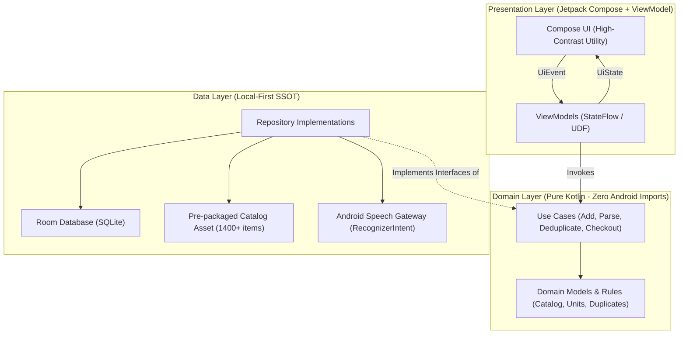
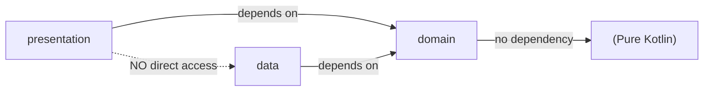
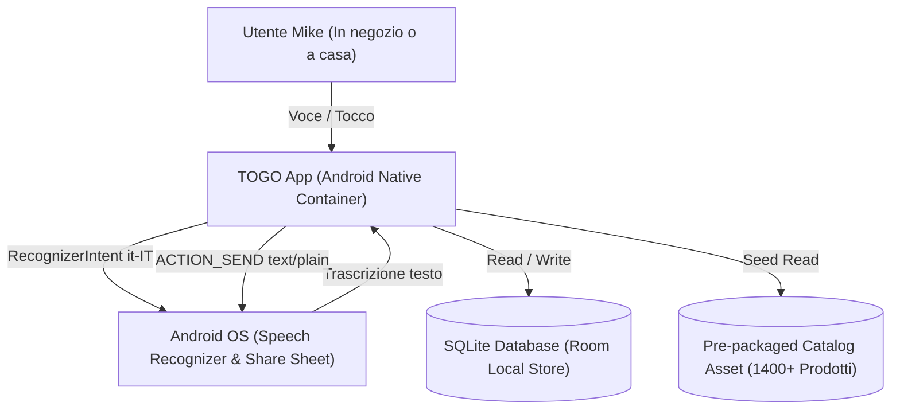
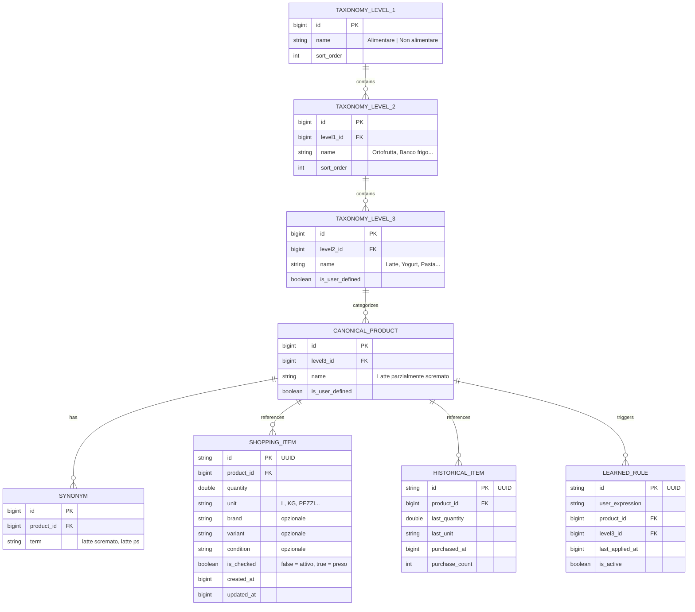

# Architecture Spine — Togo

## Design Paradigm

TOGO adotta una **Clean Architecture con Unidirectional Data Flow (UDF / MVI)** implementata in Kotlin nativo su Android. Il codice è strutturato in tre layer concentrici con direzione delle dipendenze rigorosamente verso l'interno:

1. **Presentation Layer (`feature.*`, `ui.*`):** Composable Jetpack Compose e Android `ViewModel`. Gestisce il rendering dell'interfaccia ad alto contrasto secondo `DESIGN.md`, riceve intenti utente ed emette stati immutabili (`StateFlow<UiState>`).
2. **Domain Layer (`domain.*`):** Nucleo logico in **puro Kotlin** (nessuna dipendenza da framework Android). Contiene Use Case, entità di dominio, algoritmo di parsing vocale/testuale, normalizzazione unità e logica di rilevamento duplicati.
3. **Data Layer (`data.*`):** Implementazione dei repository, database Room SQLite (local-first SSOT), gateway vocale di sistema (`RecognizerIntent`) e gestione del seed del catalogo.



## Invariants & Rules



### AD-1 — Pure Kotlin Domain Layer [ADOPTED]

- **Binds:** `domain.model`, `domain.parser`, `domain.normalizer`, `domain.usecase`, all business logic.
- **Prevents:** Accoppiamento delle regole di business (parsing della lingua italiana, normalizzazione unità, deduplicazione) al framework Android (`Context`, `AndroidViewModel`, `RecognizerIntent`), garantendo testabilità unitaria istantanea e isolamento architetturale.
- **Rule:** Il package `domain` non deve contenere alcun import da `android.*`. Tutte le dipendenze esterne devono essere modellate tramite interfacce (Gateway / Repository pattern). I test del dominio devono essere eseguiti come test JVM puri senza emulatore o Robolectric.

### AD-2 — Single-Writer Local Persistence via Room & Kotlin Flow [ADOPTED]

- **Binds:** `data.database`, `domain.repository`, `data.repository`, gestione lista attiva, storico e tassonomia.
- **Prevents:** Incoerenze e race condition tra schermate (es. modifica vocale contemporanea a spunta in corsia), desincronizzazioni di stato e letture parziali durante le transazioni di checkout.
- **Rule:** Il database SQLite locale gestito tramite Room è l'unica sorgente di verità (Single Source of Truth) dell'app. Qualsiasi lettura di stato verso la UI avviene tramite flussi immutabili `Flow<T>`. Tutte le mutazioni (aggiunta, spunta, conclusione spesa, eliminazione) devono essere atomiche, eseguite su thread IO e coordinate esclusivamente tramite `ShoppingListRepository`. L'operazione "Concludi spesa" (`CheckoutShoppingListUseCase`) esegue una transazione atomica Room che trasferisce tutte le voci con `is_checked = 1` nella tabella `HISTORICAL_ITEM` (upsert incrementando `purchase_count`), le rimuove da `SHOPPING_ITEM`, e preserva intatte le voci non spuntate.

### AD-3 — Bundled Pre-populated Catalog Seed with User Overlay [ADOPTED]

- **Binds:** Catalogo prodotti (FR-11, FR-12), tassonomia Livello 1-3, sinonimi.
- **Prevents:** Dipendenza da connessioni di rete per il cold start, attese al primo avvio per importazioni pesanti o corruzione del catalogo curato di riferimento (1.000 alimentari + 400 non alimentari) da parte di modifiche dell'utente.
- **Rule:** Il catalogo curato iniziale è fornito come database SQLite precompilato (`catalog.db`) distribuito negli asset dell'APK e inizializzato al primo avvio tramite `createFromAsset()`. Le nuove Famiglie prodotto o Livelli 3 creati dall'utente risiedono nella stessa struttura con flag esplicito `is_user_defined = 1` o in tabelle dedicate di overlay, in modo che eventuali aggiornamenti del catalogo base non sovrascrivano mai le personalizzazioni locali.

### AD-4 — Decoupled Speech Gateway via Android RecognizerIntent [ADOPTED]

- **Binds:** `feature.voice`, `data.voice`, FR-3, FR-4.
- **Prevents:** Blocco dell'applicazione o indisponibilità delle funzioni core in assenza di connettività, e accoppiamento rigido con SDK AI o vocali proprietari di terze parti.
- **Rule:** L'input vocale è astratto dietro l'interfaccia `VoiceRecognitionGateway`. L'implementazione utilizza `RecognizerIntent.ACTION_RECOGNIZE_SPEECH` con lingua esplicita `it-IT`. In caso di errore di rete, mancato riconoscimento o rifiuto dei permessi, il gateway restituisce un fallimento tipizzato `SpeechResult.Failure` e la UI consente l'immediato passaggio alla compilazione/completamento manuale senza perdere il contesto.

### AD-5 — Deterministic 4-Stage Input Pipeline (Tokenize -> Match -> Deduplicate -> Confirm) [ADOPTED]

- **Binds:** `domain.usecase.ProcessItemInputUseCase`, inserimento vocale e manuale (FR-1, FR-3, FR-5, FR-6, FR-7).
- **Prevents:** Mutazioni silenziose della lista, aggregazioni arbitrarie di unità incompatibili (es. sommare pezzi a litri), o salvataggi di voci non classificate nel catalogo.
- **Rule:** Qualsiasi input (testo trascritto dal vocale o digitato dall'utente) attraversa obbligatoriamente la pipeline deterministica a 4 stadi:
  1. *Tokenize & Extract:* estrazione di quantità numerica, unità di misura, nome prodotto ed eventuali attributi (marca, variante, conservazione);
  2. *Catalog Match:* risoluzione sul catalogo per individuare il Prodotto canonico e la Categoria canonica (Livello 1 -> Livello 2 -> Livello 3);
  3. *Duplicate Check:* scansione della lista attiva per verificare se esiste già una voce corrispondente allo stesso Prodotto canonico nella stessa categoria. Il controllo considera duplicato potenziale qualunque voce attiva presente in `SHOPPING_ITEM` (anche se spuntata nella sessione corrente prima del checkout);
  4. *User Confirmation Gate:* se è rilevato un duplicato, vengono presentate le tre scelte esclusive:
     - *Somma quantità:* consentita solo se le unità sono compatibili (es. kg e g, l e ml); aggiorna la riga esistente convertendo e sommando le quantità e aggiornando `updated_at`;
     - *Sostituisci:* sovrascrive quantità, unità e attributi della riga esistente previa conferma;
     - *Crea voce separata:* inserisce un nuovo record indipendente in `SHOPPING_ITEM` con nuovo UUID.
     Se il prodotto non è nel catalogo o l'unità è sconosciuta, si richiede chiarimento esplicito. Nessuna voce viene salvata automaticamente in modo opaco.

### AD-6 — Unidirectional Data Flow (UDF) & Screen State in Presentation [ADOPTED]

- **Binds:** Schermate Compose (`ActiveListScreen`, `VoiceSheet`, `ItemDetailSheet`, `HistoryScreen`).
- **Prevents:** Molteplicità di stati mutabili sparsi tra Composable, cicli infiniti di ricomposizione e incoerenze visive durante animazioni di check-off.
- **Rule:** Ogni schermata o foglio modale è governato da una singola classe di stato immutabile `UiState` esposta tramite `StateFlow` dal rispettivo `ViewModel`. La UI reagisce esclusivamente allo stato emesso ed invia interazioni sotto forma di eventi sigillati (`UiEvent`). Nessun Composable memorizza stato di dominio in `rememberSaveable` se non per dettagli puramente cosmetici o transitori (es. posizione di scroll o testo in digitazione non ancora inviato).

### AD-7 — Sandbox Plain-Text Sharing via Android Intent [ADOPTED]

- **Binds:** FR-10, `feature.share`.
- **Prevents:** Dipendenze da server di condivisione esterni, registrazioni account o fughe involontarie dello storico acquisti e delle regole apprese dell'utente.
- **Rule:** La condivisione esporta esclusivamente i prodotti correntemente attivi (non spuntati), formattati come testo leggibile strutturato per categoria (Livello 2 / Livello 3). L'invio avviene tramite Android `Intent.ACTION_SEND` (`text/plain`). Nessun dato dello storico o metadato privato dell'utente viene mai incluso nell'export.

## Consistency Conventions

| Concern | Convention |
| --- | --- |
| Naming (Entità e Modelli) | PascalCase: `ShoppingItem`, `CanonicalProduct`, `TaxonomyLevel`, `LearnedRule`, `HistoricalItem`. |
| Naming (Use Cases) | Verbo + Nome + `UseCase`: `ProcessItemInputUseCase`, `CheckOffItemUseCase`, `CheckoutShoppingListUseCase`, `ResolveDuplicateUseCase`. |
| Naming (Repository) | Nome + `Repository` (interfaccia in `domain`), `Room` + Nome + `Repository` o Nome + `RepositoryImpl` (in `data`). |
| Naming (UI & Compose) | Schermate terminano in `Screen` (es. `ActiveListScreen`), fogli in `BottomSheet` (es. `VoiceBottomSheet`), dialog in `Dialog` (es. `DuplicateResolutionDialog`). |
| Formato Identificativi | `UUID` v4 in formato stringa esadecimale per ID delle voci spesa e storico; interi a 64 bit (`Long`) per ID del catalogo tassonomico preinstallato. |
| Formato Date e Timestamp | Unix epoch milliseconds (`Long`) per persistenza interna SQLite; formattazione locale `it-IT` in presentazione. |
| Rappresentazione Quantità | Valore scalare (`Double` o `BigDecimal`) associato a enum tipizzato `StandardUnit` (`Gram`, `Kilogram`, `Milliliter`, `Liter`, `Piece`, `Package`, ecc.). |
| Gestione Errori | Sealed class / interface di dominio `AppResult<T>` (`Success`, `Failure(ErrorType)`) o eccezioni tipizzate gestite nei repository. Zero crash non catturati. |
| Iniezione Dipendenze | Koin 4.x con moduli espliciti (`domainModule`, `dataModule`, `presentationModule`). Nessuna iniezione manuale tramite singleton globali. |
| Concorrenza e Threading | Coroutines con Dispatcher espliciti: `Dispatchers.IO` per DB e storage, `Dispatchers.Default` per parsing/NLP regex, `Dispatchers.Main` per UI. |

## Stack

| Name | Version |
| --- | --- |
| Kotlin | 2.4.20 |
| Android Gradle Plugin (AGP) | 8.12.3 (min. richiesto da KSP 2.3.x — `addKspConfigurations`) |
| Gradle | 8.13 |
| KSP (Room codegen) | 2.3.12 (standalone; richiede AGP ≥ 8.12) |
| Android SDK (Compile & Target) | 35 |
| Android SDK (Min API) | 24 |
| Jetpack Compose BOM | 2026.09.00 |
| Jetpack Compose Material 3 | via BOM |
| Room Database (KSP) | 3.0.1 |
| Koin Android & Compose | 4.2.2 |
| Kotlinx Coroutines | 1.9.0 |
| Kotlinx Serialization | 1.7.3 |

## Structural Seed

### System Context Diagram



### Core Entity Relationship Diagram (ERD)



### Source Tree Scaffold

```text
app/src/main/java/it/togo/app/
  TogoApplication.kt                 # Inizializzazione Koin e lifecycle globale
  di/                                # Moduli di Dependency Injection (Koin)
    AppModule.kt
    DatabaseModule.kt
    RepositoryModule.kt
    UseCaseModule.kt
  domain/                            # Layer puro Kotlin (Zero dipendenze Android)
    model/                           # Entità di dominio immutabili
      ShoppingItem.kt
      CanonicalProduct.kt
      Taxonomy.kt
      StandardUnit.kt
      LearnedRule.kt
    parser/                          # Logica di tokenizzazione ed estrazione
      VoiceCommandParser.kt
      UnitNormalizer.kt
    usecase/                         # Business capabilities
      ProcessItemInputUseCase.kt
      DetectDuplicateUseCase.kt
      AddShoppingItemUseCase.kt
      CheckOffItemUseCase.kt
      CheckoutShoppingListUseCase.kt
      ShareActiveListUseCase.kt
    repository/                      # Interfacce di astrazione dati
      ShoppingListRepository.kt
      CatalogRepository.kt
      HistoryRepository.kt
      LearnedRulesRepository.kt
  data/                              # Layer di persistenza e gateway esterni
    database/                        # Room Database & DAOs
      TogoDatabase.kt
      dao/
        ShoppingItemDao.kt
        CatalogDao.kt
        HistoryDao.kt
        LearnedRulesDao.kt
      entity/
        ShoppingItemEntity.kt
        CatalogEntities.kt
        HistoryEntity.kt
        LearnedRuleEntity.kt
    repository/                      # Implementazioni repository
      RoomShoppingListRepository.kt
      RoomCatalogRepository.kt
      RoomHistoryRepository.kt
      RoomLearnedRulesRepository.kt
    voice/                           # Gateway vocale Android
      AndroidVoiceRecognitionGateway.kt
  feature/                           # Presentation Layer (Jetpack Compose + ViewModel)
    activelist/                      # Schermata principale lista "Spesa"
      ActiveListScreen.kt
      ActiveListViewModel.kt
      ActiveListUiState.kt
      components/
        ActiveItemRow.kt
        CheckedSection.kt
        CategoryHeader.kt
    voice/                           # Bottom sheet cattura vocale
      VoiceInputBottomSheet.kt
      VoiceInputViewModel.kt
      VoiceInputUiState.kt
    manualentry/                     # Dialog / Sheet inserimento & modifica
      ItemDetailBottomSheet.kt
      ItemDetailViewModel.kt
    duplicates/                      # Modal risoluzione duplicati
      DuplicateResolutionDialog.kt
    history/                         # Storico prodotti acquistati
      HistoryScreen.kt
      HistoryViewModel.kt
    learnedrules/                    # Gestione regole apprese
      LearnedRulesScreen.kt
      LearnedRulesViewModel.kt
  ui/                                # Design System (DESIGN.md tokens)
    theme/
      Color.kt                       # Token colore High-Contrast Utility
      Type.kt                        # Token tipografici Roboto
      Theme.kt                       # TogoTheme Material3 wrapper
```

## Capability → Architecture Map

| Capability / Requirement | Lives in | Governed by |
| --- | --- | --- |
| FR-1: Creazione voce manuale | `feature.manualentry`, `domain.usecase.AddShoppingItemUseCase` | AD-1, AD-5, AD-6 |
| FR-2: Visualizzazione e ordinamento lista | `feature.activelist`, `domain.repository.ShoppingListRepository` | AD-2, AD-6 |
| FR-3: Aggiunta vocale di un prodotto | `feature.voice`, `data.voice`, `domain.parser.VoiceCommandParser` | AD-1, AD-4, AD-5 |
| FR-4: Conferma e annullamento vocale | `feature.voice.VoiceInputBottomSheet`, `domain.usecase` | AD-4, AD-5, AD-6 |
| FR-5: Assegnazione categoria e apprendimento | `domain.usecase.ProcessItemInputUseCase`, `data.repository.RoomLearnedRulesRepository` | AD-1, AD-2, AD-5 |
| FR-6: Normalizzazione prodotto e quantità | `domain.parser.UnitNormalizer`, `domain.model.StandardUnit` | AD-1, AD-5 |
| FR-7: Rilevamento duplicati e risoluzione | `domain.usecase.DetectDuplicateUseCase`, `feature.duplicates` | AD-1, AD-5, AD-6 |
| FR-8: Depennamento voce (check-off) | `feature.activelist`, `domain.usecase.CheckOffItemUseCase` | AD-2, AD-6 |
| FR-9: Riaggiunta da storico | `feature.history`, `domain.usecase.AddShoppingItemUseCase` | AD-1, AD-2, AD-5 |
| FR-10: Condivisione lista attiva | `domain.usecase.ShareActiveListUseCase`, `Android OS Intent` | AD-7 |
| FR-11: Catalogo iniziale e ricerca (1400+ prodotti) | `data.database`, `domain.repository.CatalogRepository` | AD-1, AD-2, AD-3 |
| FR-12: Estensione controllata catalogo | `feature.manualentry`, `data.repository.RoomCatalogRepository` | AD-1, AD-3 |
| FR-13: Attributi prodotto (marca, variante, conservazione) | `domain.model.ShoppingItem`, `feature.manualentry` | AD-1, AD-5 |
| FR-14: Contributi catalogo centrale (evoluzione futura) | Deferred / evoluzioni successive | Deferred (nessuna dipendenza cloud MVP) |

## Deferred

Le seguenti decisioni sono esplicitamente rinviate a rilasci successivi per preservare l'integrità del perimetro MVP local-first:

1. **Sincronizzazione Cloud Multi-Device & Collaborazione:**
   - *Motivazione:* L'MVP è al 100% local-first su un singolo dispositivo (Mike). L'introduzione di CRDT, backend remoto o autenticazione complicherebbe lo stack senza validare il valore primario dell'app.
2. **Server Centrale per Nuovi Prodotti & Moderazione AI (FR-14):**
   - *Motivazione:* Le aggiunte degli utenti rimangono strettamente locali in SQLite. La pipeline di invio proposte, deduplicazione remota e governance del catalogo centrale richiede un'infrastruttura backend dedicata non necessaria al lancio.
3. **Scansione Barcode / OCR Scontrini:**
   - *Motivazione:* Il percorso prioritario di cattura è il binomio voce + ricerca testuale rapida nel catalogo curato. La gestione di scanner ottico e database SKU commerciali è differita a una fase successiva.
4. **Supporto Multi-Lista e Percorsi Ottimizzati nel Supermercato:**
   - *Motivazione:* L'esperienza è concentrata sull'unica lista attiva "Spesa" ordinata per corsie standard della grande distribuzione italiana. L'ordinamento personalizzato per negozio o store layout è posticipato.
